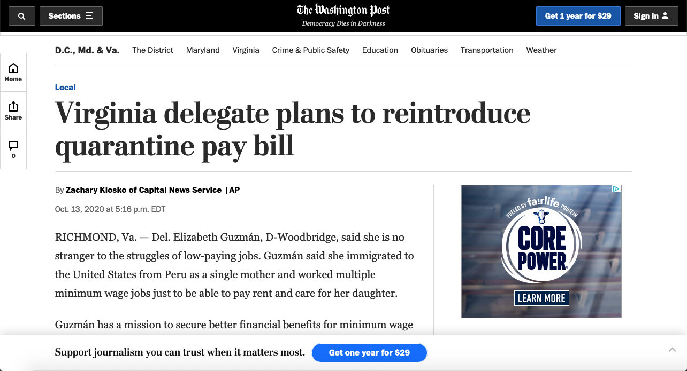
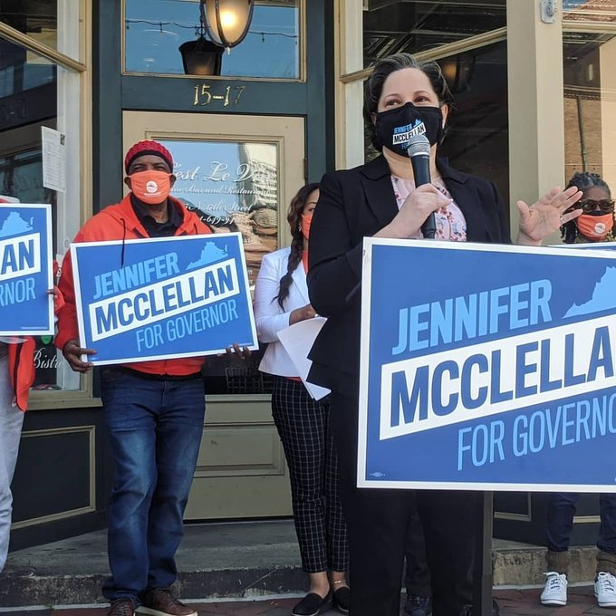

I never planned to get a journalism degree. What I really wanted was to do creative things with media: recording music, taking photos, engineering a TV show, having a morning show on a popular radio station. Digital Journalism - the degree - was a safer way to "study" for one of those outcomes, each of which was getting significantly more competitive each day.

The nature of being curious suited me well. I remember especially being curious about local politics, and was one of two (or maybe it was just me, I can't remember) students in my class who intentionally decided to report on local politics. I wanted to know how people ticked, why they believed the things they did - the psychological nature of it all. I was curious about the people themselves, and oh the people I got invited to meet.

COVID didn't change all that, but it did give me a unique opportunity. Getting settled in with a local low-power FM radio station right before the pandemic hit gave me the opportunity to help keep the station running around the time we feared lockdowns starting. I lived in a small studio apartment at the time, and I welcomed any opportunity I could get to leave my apartment if the entire city shut down. After all, said radio station was the city's emergency broadcast station, so I could potentially be exempt from any lockdown that might happen if it ever did.

While looking into how to install a free piece of open-source radio automation software ([Libretime](https://www.libretime.org)) I came across a "help edit this page" button in their documentation, which brought me to Github. I used Github a lot for my Data Science major, so it felt familiar and exciting. I started writing documentation for the project, then helping rewrite their website in Jekyll (and then a second time, and then in Docusaurus, but that's beside the point), and even helping build features for Libretime that still exist in the codebase today. Exporting your playout log to PDF and CSV even though Adobe Flash died a painful death years ago? I got you, written in Javascript that should probably be refactored after all the things I've learned since.

Don't get me wrong, I still liked reporting. I got published in the Washington Post and Associated Press following legislation to increase the minimum wage in Virginia. I worked hard and found myself helping my teachers edit my classmates' articles, something I think I liked more than writing articles myself. But I also liked Linux, and Docker, and rewriting old Bash scripts to run in shiny new Docker containers, and then running those containers for hours in class on my minimum-spec Macbook Air 2015 to make sure they performed correctly. I didn't like Windows Server and the headaches Active Directory brought to the table, but I learned to appreciate them as soon as I started replacing them with "one-size-fits-most" services, even though it would be better for volunteers in the long run. As much as I found myself looking for interesting stories on Twitter (long before Elon purchased it) I found myself helping build, break, and rebuild the things others needed to tell stories relevant to them.

The shift came from the "perfect storm" for student reporters in that era: COVID, the death of George Floyd, and the inevitable burnout of trying to cover all the bases while having to manage schoolwork, mental health, and finding a therapist we could afford after Student Counseling told us we needed to find someone else. I could go to interviews and press conferences, once as an invitation from a prominent gubernatorial candidate (who didn't win), but I couldn't write. I clawed myself through my reporting and schoolwork, only got published in smaller papers, and kept my head down while keeping the radio station running. I did graduate, but it felt like I barely made it.

Politics and mass media were in the first stages of the war that politics would ultimately win, a depressing sight for a bright-eyed journalism student. Our teachers spoke honestly of the shifts going on in local and national media outlets, gave us tips on how to advocate for ourselves, and told us multiple times they honestly believed our generation would be the ones to make the change in how stories were reported, how we would be able to hold up ethics and integrity in ways that couldn't be taken away be investors, how we could make a difference.

Jeff Bezos had already purchased The Washington Post at this point. Now we know.

The moment that killed the dream for me was the tweet that made me semi-famous in Richmond, VA, tweeted one month before I graduated. It was reporting on what I saw in front of me; something like:

> "RVA police are preparing for protests to break out in Monroe Park, bringing multiple squad cars and K-9 units to discourage public disturbances, but the loudest sounds are coming from a volleyball game among students (a tight game with a score of 3-2)"

This is moments after police office Derek Chauvin was convicted on three counts of second degree murder of George Floyd. I never thought it was possible to get that many retweets and likes for a post I largely thought was mundane. I never thought I would get a job interview from Virginia Business Magazine from a single tweet. I never thought I could be a topic of local internet conversation from a tweet, let alone that tweet. All those things came true within 24 hours of clicking "send".

But the moment I realized I couldn't keep going came in reading the incredibly positive responses to my tweet. People were mostly "on my side" (note: there are no sides in ethical reporting), overwhelming so, or overwhelming against what I said despite the two pictures I attached proving what I said took place on that day. People had already decided to hate the cops or love the cops, long before I wrote the post and took the pictures, and that post allowed them to pretend to confirm their biases when I was doing the boring job of reporting the thing happening in front of me.

It was depressing for me. I didn't think I was being taken seriously my reporting. I had sacrificed my mental health, been a little too close to anxious police officers with tear gas, and stayed up way past my bedtime in pursuit of a story, but it only mattered if it could be used as a prop in political warfare.

So I graduated, signing "thank you all" in ASL to the camera handling IMAG and live stream as my name was called, and starting looking for jobs, among the burnout, depression, and Docker RAM issues I kept having. I continued serving at the church I was going to in its tech and students teams, and completed a rather impressive server migration over at the radio station, while hoping a company would notice my hard work and bring me in.

Remember the tweet above? My own highly-regarded professor responded to it with:

> Hire this reporter.

Still no newsroom jobs came.

What did come was a renewed calling to infrastructure work. Keeping WRIR running became my main goal, with migrations from a cheap TP-Link router to pfSense, two Synologies into one with marginally better specs, SSH tunneling through the Andes mountains to a proper VPN setup, whatever it took to keep people working on their shows from home. It's hard to find your purpose during burnout, but for me somehow I was able to keep pushing on regardless of how I felt inside. Incredibly unhealthy, but gave me enough sense of purpose to keep going.

If I couldn't get myself to cover the news, I could at least make sure that others had the resources they needed to cover the news. I know it was appreciated, and I was proud of it. No matter how drained job applications made me feel, station operations gave me life, to the extent it could when there wasn't a problem that had to be fixed "yesterday". I finally abandoned the idea of putting _everything_ in Docker images, and kept working on the two things that made sense to put in Docker. White label solutions began to replace homemade ones. Proper audio interfaces replaced aging automixers, WebDAV accounts were easier to create, and redundant stream recorders kept my butt covered. All was right in the world, minus everything that wasn't (like me not having a paying job).

Even though I didn't plan to get a journalism degree, I didn't plan to walk away from it. I was hoping a job in a newsroom would fix everything I felt about my ability to contribute to the world of journalism, but that job didn't come. I got hired by Hope Church in June of 2021, and in the five years that have passed, I haven't thought about looking for a place in a newsroom at all. The journalism industry looks a bit different now with the 2026 version of "We Didn't Start The Fire": Bari Weiss, Donald Trump, CNN, 60 Minutes, WaPo layoffs, Tenga merger, AI writing, web page death by advertising. Maybe I should miss it, but there isn't much left for me to miss.

I now have a wife and two ~~kids~~ cats. I have a good job in live event production. I just got my Q-SYS Level 1 certification. I like where I am now. Let's just let bygones be bygones...
